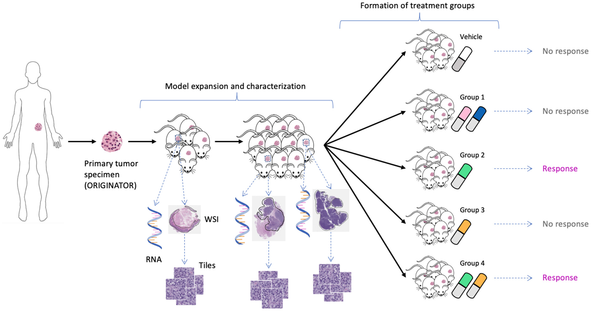

Multimodal neural network for drug response prediction in PDX with histology images and gene expressions.



> **Figure 1** from Partin et al. (2023): expansion of tumor tissue from the source specimen (ORIGINATOR) to mice across multiple passages. Mice originated from the same specimen are divided into a control group and multiple treatment groups. Tumors from certain mice were histologically and molecularly profiled, resulting in whole-slide images and omics profiles. Reproduced under [CC BY 4.0](https://creativecommons.org/licenses/by/4.0/).

## Paper

Partin A, Brettin T, Zhu Y, Dolezal JM, Kochanny S, Pearson AT, Shukla M, Evrard YA, Doroshow JH, Stevens RL.
**Data augmentation and multimodal learning for predicting drug response in patient-derived xenografts from gene expressions and histology images.**
*Frontiers in Medicine* 10 (2023). [doi:10.3389/fmed.2023.1058919](https://www.frontiersin.org/journals/medicine/articles/10.3389/fmed.2023.1058919/full)

See [`PAPER.md`](PAPER.md) for the exact pipeline (bash scripts, project subdirs, per-run hyperparameters) used to produce each row of the paper's results table. `rerun_paper_aggregation.py` reproduces the MM-Net, UME-Net, UMH-Net, and LGBM headline rows from the on-disk runs; the two ablation rows' runs aren't on this workstation — see `PAPER.md`.

## Build tidy dataframe of drug response samples for binary classification
The dataframe will be stored in `data/processed`.
```
$ python scripts/build_tidy_drug_pairs_all_samples.py
```

## Generate TFRecords for drug response from TFRecords of WSIs
The TFRecords will be stored in `data/PDX_FIXED_RSP_DRUG_PAIR*`.
Depending on the input args, the designated folder will be created.
For example, the following command will create `data/PDX_FIXED_RSP_DRUG_PAIR_rnd_glob_min`.
```
$ python scripts/update_tfrecords.py --random --take_glob_min
```

## Specify Hyperparameters (HPs)
Defaults live in `default_params/default_params_<feacombo>.json`, one file per modality combination (`tile_ge_dd1_dd2`, `ge_dd1_dd2`, `tile_dd1_dd2`, etc.). On first run for a given project, `src/trn_multimodal.py` copies the matching template into `projects/<prjname>/params_<feacombo>.json` and uses the per-project copy from then on. Edit the project copy to change HPs without affecting the template. The per-split `params.json` saved alongside each trained model is the source of truth for what was actually used in that run — see [`PAPER.md`](PAPER.md) for the exact values that produced the paper.


## Train baselines (analysis of data augmentation)
```
$ ./scripts/ge_dd1_dd2_drop_aug.bash
```
```
$ ./scripts/ge_dd1_dd2_only_pairs.bash
```

## Train multimodal deep learning model
Specify the parameters in the bash script as necessary.
```
./scripts/tile_ge_dd1_dd2.bash
```
The results will be written to `projects/bin_rsp_drug_pairs_all_samples`.
